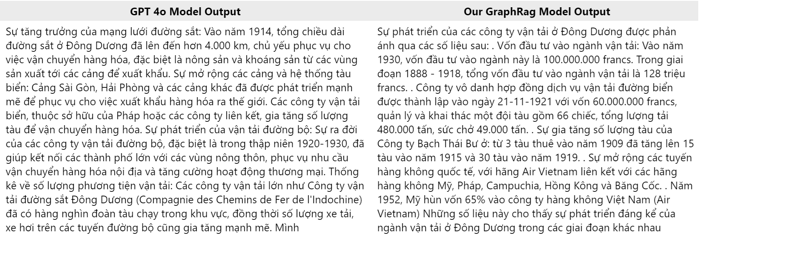

# Graph-RAG: Graph Retrieval-Augmented Generation for Historical Questions

Graph-RAG is an innovative system designed to answer historical questions with a focus on Vietnamese historical data. This project leverages graph-based representations to capture complex interconnections between key concepts, events, and entities within historical texts. By integrating graph retrieval-augmented generation techniques, Graph-RAG enhances answer accuracy and provides reliable numerical data, making it an effective tool for both historical research and education.

---

## Overview

Understanding and answering historical questions is crucial for preserving and disseminating cultural knowledge. Graph-RAG addresses this need by:

- **Constructing Graphs:** Nodes represent key historical concepts, events, or entities, while edges are defined based on embedding-based similarity and the strength of relationships between nodes.
- **Enhancing Accuracy:** The system delivers context-aware answers and provides more reliable numerical data compared to baseline methods.
- **Focusing on Vietnamese History:** Utilizing a self-developed dataset, Graph-RAG brings forward a detailed exploration of Vietnam’s rich and diverse history.

---

## Dataset: DHH-Vietnamese History Dataset

Graph-RAG is powered by the **DHH-Vietnamese History Dataset**, which includes:

- **15 Volumes of Vietnamese History:** Sourced from the Hanoi Institute of History.
- **Grade 12 Vietnamese History Textbook:** Provides academic and standardized historical content.
- **Additional Internet Sources:** Ensures diverse perspectives and supplementary historical data.

This curated dataset is central to training and evaluating Graph-RAG, making it a robust resource for answering complex queries about Vietnam’s history.

---

## Key Features

- **Graph-Based Data Representation:** Captures intricate relationships between historical data points, enhancing the context-awareness of generated answers.
- **Retrieval-Augmented Generation:** Combines graph retrieval with generation techniques to improve answer relevance and precision.
- **Enhanced Numerical Accuracy:** Delivers more reliable numerical information compared to conventional historical Q&A systems.
- **Culturally Focused:** Tailored specifically to Vietnamese history, offering educators and researchers a specialized tool for exploring cultural heritage.

---

## Quantitative Evaluation

Graph-RAG has been quantitatively evaluated and demonstrates significant advancements in:

- **Answer Accuracy:** Improved precision in answering historical questions.
- **Reliability:** Better performance in providing accurate numerical data related to historical events and concepts.

